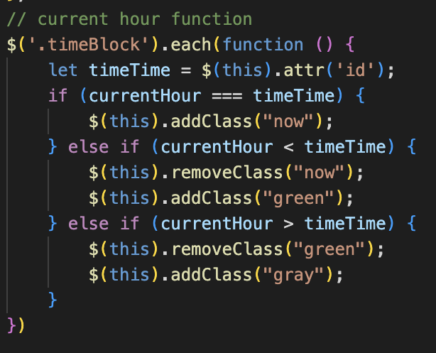
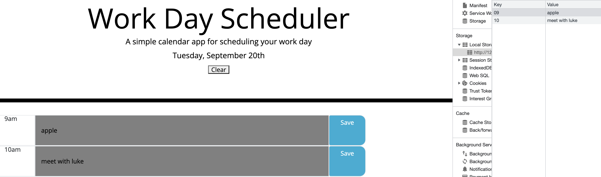

# Work Day Scheduler

## Table of Contents
1. [Description](#description)
2. [Visuals](#visuals)

## Description

Upon opening the website, you are greeted with todays current date, and then time boxes for 9am-5pm. On each box you can click and type in info, save it, and it will persist even if page is reloaded. The timeblocks also turn gray if the current time is past that specific time block, it will also turn green for future hours of the day, and red for the current hour. At the top there is also a clear button to clear all values for the entire calender.

## Visuals

This block of code determines the time of day and gives a state to each time block. So if it is past the current hour, it gets a class of green, which changes the background of that textbox to green, indicating future free time slots.

Although the timeslots are gray, this photo shows the website working with values that have been saved into local storage. At 9am it is apple time, and at 10 I have a meeting with Luke.
